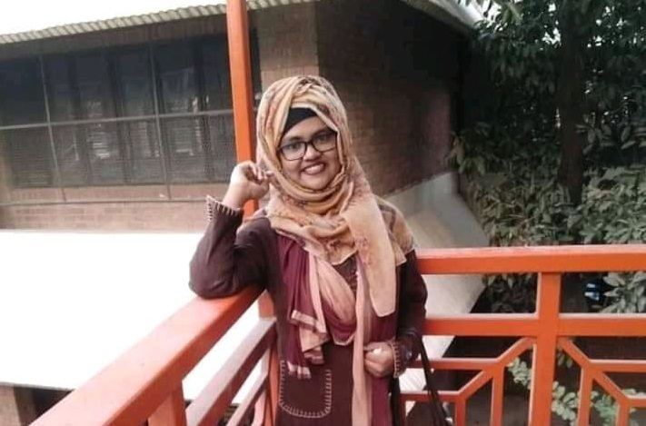

    
  <!-- Content -->
<html lang="en">

  <head>

    <meta charset="utf-8">
    <meta name="viewport" content="width=device-width, initial-scale=1, shrink-to-fit=no">
    <meta name="description" content="">
    <meta name="author" content="">
    <link href="https://fonts.googleapis.com/css?family=Raleway:100,300,400,500,700,900" rel="stylesheet">
    <title> Family</title>
<!--
SOFTY PINKO
https://templatemo.com/tm-535-softy-pinko
-->

    <!-- Additional CSS Files -->
    <link rel="stylesheet" type="text/css" href="assets/css/bootstrap.min.css">

    <link rel="stylesheet" type="text/css" href="assets/css/font-awesome.css">

    <link rel="stylesheet" href="assets/css/templatemo-softy-pinko.css">
    </head>
    
    <body>
    
    <!-- ***** Preloader Start ***** -->
    

        

            

            

            

        

    
  
    <!-- ***** Preloader End ***** -->
    
    
    <!-- ***** Header Area Start ***** -->
    <header class="header-area header-sticky">
        

            

                

                    <nav class="main-nav">
                       <!-- ***** Logo Start ***** -->
                        
                        <!-- ***** Logo End ***** -->
                        <!-- ***** Menu Start ***** -->
                        <ul class="nav">
                            <li><a href="#features">Founder</a></li>
                            <li><a href="#testimonials">Founding Members</a></li>
                            <li><a href="#blog">Review Pannel</a></li>
                            <li><a href="#pricing-plans">Members</a></li>
			    
                        </ul>
                        <a class='menu-trigger'>
                            Menu
                        </a>
                        <!-- ***** Menu End ***** -->
                    </nav>
                

            

        

    </header>
    <!-- ***** Header Area End ***** -->

    <!-- ***** Welcome Area Start ***** -->
    

        <!-- ***** Header Text Start ***** -->
        

            

                

                    

                        <h1>We have a good number of <strong>potential members</strong> and highly skilled <strong>Review Pannel</strong></h1>
                    

                

            

        

        <!-- ***** Header Text End ***** -->
    

    <!-- ***** Welcome Area End ***** -->

    <!-- ***** Features Small Start ***** -->
    <section class="section home-feature">
        

            

                

                    

                        <!-- ***** Features Small Item Start ***** -->
                        

                            

                                

                                    <i></i>
                                

                                <h5 class="features-title">Founding Members</h5>
                                
We have highly potential Founding Members to connvey the work and Projects.

                            

                        

                        <!-- ***** Features Small Item End ***** -->

                        <!-- ***** Features Small Item Start ***** -->
                        

                            

                                

                                    <i></i>
                                

                                <h5 class="features-title">Review Pannel</h5>
                                
Review pannel consisted of highly skilled Teachers and Researchers who will review and instruct your work

                            

                        

                        <!-- ***** Features Small Item End ***** -->

                        <!-- ***** Features Small Item Start ***** -->
                        

                            

                                

                                    <i></i>
                                

                                <h5 class="features-title">Members</h5>
                                
Members are enthusiastic about research and from differents univarsities.

                            

                        

                        <!-- ***** Features Small Item End ***** -->
                    

                

            

        

    </section>
    <!-- ***** Features Small End ***** -->
    
<!-- ***** Features Big Item Start ***** -->
    <section class="section padding-top-70 padding-bottom-0" id="features">
        

            

                

                    
                

                

                

                    

                        <h2 class="section-title">MD. Salman Faisal</h2>
                    

                    

                        
&#8226;Founder & CEO  &#8226;Researchsio.     Follow on     

                    

                

            

            

                

                    

                

            

        

    </section>
    <!-- ***** Features Big Item End ***** -->
    
    <!-- ***** Testimonials Start ***** -->
    <section class="section" id="testimonials">
        

            <!-- ***** Section Title Start ***** -->
            

                

                    

                        <h2 class="section-title">Founding Members</h2>
                    

                

                

                    

                        
Founding Members are the Official Body Of Researchsio. Let's get familiar with our Founding Members.

                    

                

            

            <!-- ***** Section Title End ***** -->

            

	    <!-- ***** Testimonials Item Start ***** -->
                

                    

                        

                            <i></i>
                            
Nuosaibaton Morsheda Tohfa  &#8226; B.Pharm (MIU)  &#8226; Communication Manager  &#8226; Researcher

			    

                                  <h3 class="user-name"><a href="https://www.researchsio.com">Follow On</a></h3> 
                            

                            

                                
                            

			    

			        
		            

                        

                    

                

                <!-- ***** Testimonials Item End ***** -->
		
		
		<!-- ***** Testimonials Item Start ***** -->
                

                    

                        

                            <i></i>
                            
Hamidur Rahman Mahmud  &#8226; B.Pharm (MIU)  &#8226; Technical & IT Manager  &#8226; Researcher

                            

                                  <h3 class="user-name"><a href="https://www.researchsio.com">Follow On</a></h3> 
                            

                            

                                
                            

			    

			        
		            

                        

                    

                

                <!-- ***** Testimonials Item End ***** -->
	       
	       <!-- ***** Testimonials Item Start ***** -->
                

                    

                        

                            <i></i>
                            
Motasim Billah Sakib  &#8226; M.Pharm (JNU), B.Pharm (MIU)  &#8226; Creative Manager  &#8226; Researcher

                            

                                  <h3 class="user-name"><a href="https://www.researchsio.com">Follow On</a></h3> 
                            

                            

                                
                            

			    

			        
		            

                        

                    

                

                <!-- ***** Testimonials Item End ***** -->
				
		<!-- ***** Testimonials Item Start ***** -->
                

                    

                        

                            <i></i>
                            
Nishan Chakrabarty  &#8226; B.Pharm (IIUC), M.Pharm(JNU)  &#8226; Research Advisor

                            

                                  <h3 class="user-name"><a href="https://www.researchsio.com">Follow On</a></h3> 
                            

                            

                                
                            

			    

			        
		            

                        

                    

                

                <!-- ***** Testimonials Item End ***** -->
		
    
                <!-- ***** Testimonials Item Start ***** -->
                

                    

                        

                            <i></i>
                            
Md. Golam Nobi  &#8226; M. Pharm (SUB),B.Pharm (MIU)   &#8226; Organizing Advisor  

                            

                                  <h3 class="user-name"><a href="https://www.researchsio.com">Follow On</a></h3> 
                            

                            

                                
                            

			    

			        
		            

                        

                    

                

                <!-- ***** Testimonials Item End ***** -->
              
	       <!-- ***** Testimonials Item Start ***** -->
                

                    

                        

                            <i></i>
                            
Suborna Mahazabin   &#8226; Resource Management & Enterprenureship (College of Home Economics)   &#8226; Financial Manager   

                            

                                  <h3 class="user-name"><a href="https://www.researchsio.com">Follow On</a></h3> 
                            

                            

                                
                            

			    

			        
		            

                        

                    

                

                <!-- ***** Testimonials Item End ***** -->
		
		<!-- ***** Testimonials Item Start ***** -->
                

                    

                        

                            <i></i>
                            
Ahmad Tarique Hasan   &#8226; Computer Science and Engineering   &#8226; Assistant Creative Manager   

                            

                                  <h3 class="user-name"><a href="https://www.researchsio.com">Follow On</a></h3> 
                            

                            

                                
                            

			    

			        
		            

                        

                    

                

                <!-- ***** Testimonials Item End ***** -->

		

        

    </section>
    <!-- ***** Testimonials End ***** -->
    
    <!-- ***** Blog Start ***** -->
    <section class="section" id="blog">
        

           
	   <!-- ***** Section Title Start ***** -->
            

                

                    

                        <h2 class="section-title">Review Pannel</h2>
                    

                

                

                    

                        
Our respected highly skilled Reviewer:

                    

                

            

            <!-- ***** Section Title End ***** -->

            

	      

                    

                        

                            
                        

                        

                            <h3>
                                <a href="#">Prof. Anwar H. Joarder </a>
                            </h3>
                            

                            Dean, Faculty of Science & Engineering  NUBT, Khulna.    Online Lecturer/Trainer (Researchsio)
                            
 
                        

                    

                

	      

                    

                        

                            
                        

                        

                            <h3>
                                <a href="#">Mst. Rikta Banu</a>
                            </h3>
                            

                             Lecturer at Manarat International University.  Department of Pharmacy.   Reviewer on- &#8226; Biopharmaceutics &#8226;Pharmaceutical technology. 
                            

                        

                    

                

                

                    

                        

                            
                        

                        

                            <h3>
                                <a href="#">Md. Shafayat Ahmed Siddiqui </a>
                            </h3>
                            

                            Lecturer at Manarat International University.  Department of Pharmacy.    Reviewer on- &#8226; Biotechnology. &#8226;Genomics. &#8226;Biochemistry and Molecular Biology.  &#8226;Theoretical and Computational Chemistry.
                            
 
                        

                    

                
 
		
              

                    

                        

                            
                        

                        

                            <h3>
                                <a href="#">Dr. Ashiquddin Md. Maruf </a>
                            </h3>
                            

                            Assistant Professor, Department of Law.  NUBT, Khulna.    Consultant and Reviewer (Researchsio)
                            
 
                        

                    

                
 
		
		

                    

                        

                            
                        

                        

                            <h3>
                                <a href="#">Abrar Wahab </a>
                            </h3>
                            

                                Masters in Public Health  Evaluation and Research Officer  Shornokishoree Network Foundation   Area of expertise are: &#8226; Epidemiology &#8226;Mental Health &#8226;Internet Addiction &#8226;Sleep Disturbance &#8226;Antibiotic Resistance &#8226;Adolescent Health &#8226;Nutrition 
                            
 
                        

                    

                
 
		 
                

                    

                        

                            
                        

                        

                            <h3>
                                <a href="#">Proshanta Roy </a>
                            </h3>
                            

                            Phd research fellow (Neuroscience)  Department of Public Health and experimental medicine, University of Camerino, Italy    Reviewer on- &#8226; Biotechnology. &#8226;Neuroscience. &#8226;Immunology. 
                            
 
                        

                    

                
 
		
		 

                    

                        

                            
                        

                        

                            <h3>
                                <a href="#"> Atikul Islam </a>
                            </h3>
                            

                           Research and Training Assistant   Institute of Biomedical Science,   National chung Shing University, Taiwan    Reviewer on- &#8226; Pharmacology. &#8226;Cancer Biology. &#8226; Pharmacognosy.
			     
 
                        

                    

                
 
		
		

                    

                        

                            
                        

                        

                            <h3>
                                <a href="#"> More Qualified Individuals will be added shortly!</a>
                            </h3>
                            

                            We are in a process of adding more skilled Reviewers, Researchers and Project coordinators. Stay with us!
                            

                        

                    

                

            

	    

    </section>
    <!-- ***** Blog End ***** -->
   

    <!-- ***** Pricing Plans Start ***** -->
    <section class="section colored" id="pricing-plans">
        

	
            <!-- ***** Section Title Start ***** -->
            

                

                    

                        <h2 class="section-title">Our Members</h2>
                    

                

                

                    

                        
Members are the heart of Researchsio.

                    

                
 
            <!-- ***** Section Title End ***** -->
	    
	    
	    
	   <!-- ***** Pricing Item Start ***** -->
                

                        

                            

                               <a href="Session first.html" class="main-button">First Session Members</a>
			         <a href="first session Coming Soon.html" class="main-button">Second Session Recruitment</a>
                            

                        

			

			
                <!-- ***** Pricing Item End ***** -->
	

        

    </section>
    <!-- ***** Pricing Plans End ***** -->

   
    <!-- Footer -->
    <footer>
	<footer id="footer">
		

			<ul class="icons">
				
				<li><a href="{{ site.twitter_url }}" class="icon alt fa-twitter" target="_blank">Twitter</a></li>
				
				
				<li><a href="{{ site.googleplus_url }}" class="icon alt fa-google-plus" target="_blank">Google+</a></li>
				
				
				<li><a href="{{ site.facebook_url }}" class="icon alt fa-facebook" target="_blank">Facebook</a></li>
				
				
				<li><a href="{{ site.instagram_url }}" class="icon alt fa-instagram" target="_blank">Instagram</a></li>
				
				
				<li><a href="{{ site.pinterest_url }}" class="icon alt fa-pinterest" target="_blank">Pinterest</a></li>
				
				
				<li><a href="{{ site.500px_url }}" class="icon alt fa-500px" target="_blank">500px</a></li>
				
				
				<li><a href="{{ site.gitlab_url }}" class="icon alt fa-gitlab" target="_blank">GitLab</a></li>
				
				
				<li><a href="{{ site.github_url }}" class="icon alt fa-github" target="_blank">GitHub</a></li>
				
				
				<li><a href="{{ site.slack_url }}" class="icon alt fa-slack" target="_blank">Slack</a></li>
				
				
				<li><a href="{{ site.linkedin_url }}" class="icon alt fa-linkedin" target="_blank">LinkedIn</a></li>
				
				
			</ul>
			
			
			
			<ul class="copyright">
				<li>&copy; {{ site.title }} {{ site.subtitle }} 2020</li>
			
				<li>Developed & maintained by: <a href="http://facebook.com/mahmud128" target="_blank"> Hamidur Rahman MahmuD</a></li>
				
				
				

			      </ul>
  			

		</footer>

		
	

<!-- Scripts -->
	
	
	
	
	
	<!--[if lte IE 8]><![endif]-->
	
    
    
    
    <!-- jQuery -->
    
     

    <!-- Bootstrap -->
    
    

    <!-- Plugins -->
    
    
    
     
    
    <!-- Global Init -->
    
    </footer>
